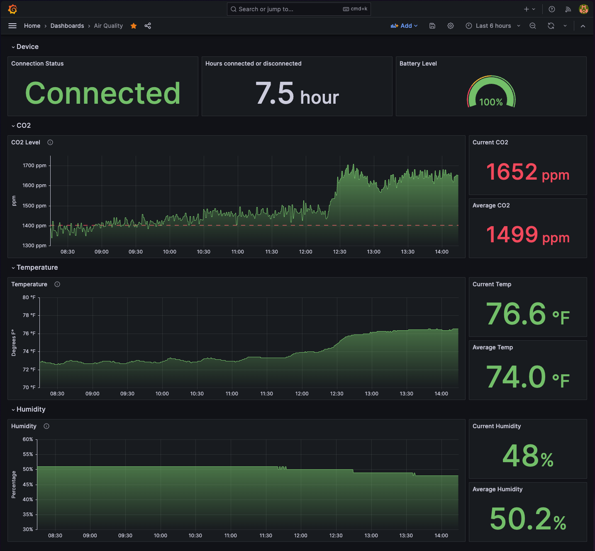

# Prometheus exporter for the aranet4 CO2 sensor

This is a Prometheus metrics exporter for the [Aranet4](https://aranet4.com/) CO2 sensor. It is written in Python and uses the [Prometheus client library](https://github.com/prometheus/client_python)

The exporter connects to the sensor over bluetooth and exposes the following metrics:

- aranet4_co2
- aranet4_temperature
- aranet4_pressure
- aranet4_humidity
- aranet4_battery_level
- aranet4_update_interval
- aranet4_since_last_update

## Usage

1. Set environment variables to configure the exporter:
    - `POLLING_INTERVAL_SECONDS` how often to poll the sensor (default: 5)
    - `EXPORTER_PORT` port to expose the metrics on (default: 80)
    - `SENSOR_MAC_ADDRESS` MAC address of the sensor to poll. If not set, the exporter will use autodiscovery to find the sensor.

1. Install the dependencies:

    ```shell
    pip install -r requirements.txt
    ```

1. Run the exporter:

    ```shell
    python src/main.py
    ```

1. Test the exporter by view the output in a browser: `http://localhost:80`

## Scraping and Dashboard

1. Add the exporter to your prometheus config:

    ```yaml
    scrape_configs:
      - job_name: co2-monitor
        static_configs:
          - targets:
              - {IP ADDRESS OF EXPORTER}:{EXPORTER_PORT}
            labels: null
            job: co2-monitor
    ```

    OR if you're using Prometheus Operator in Kubernetes, create the following ScrapeConfig CRD:

    ```yaml
    apiVersion: monitoring.coreos.com/v1alpha1
    kind: ScrapeConfig
    metadata:
      name: co2-monitor
      namespace: monitoring
      labels:
        release: kube-prometheus-stack
    spec:
      staticConfigs:
        - labels:
          job: co2-monitor
          targets:
            - {IP ADDRESS OF EXPORTER}:{EXPORTER_PORT}
    ```

2. Import the Grafana dashboard from `dashboard.json` into your Grafana instance. Choose the Prometheus data source that is configured to scrape the exporter.

    

## Notes & credits

- The exporter uses the [pyaranet4](https://github.com/stijnstijn/pyaranet4) library to communicate with the sensor. Currently there is a bug when specifying a MAC address manually, so until [this pr is merged](https://github.com/stijnstijn/pyaranet4/pull/6), i've bundled a forked version of the library in this repo with the fix applied. Thanks stinjnstijn!

- The basic scaffolding of the code for the exporter is based on [Thomas Stringer's example](https://trstringer.com/quick-and-easy-prometheus-exporter/). Thanks Thomas!
